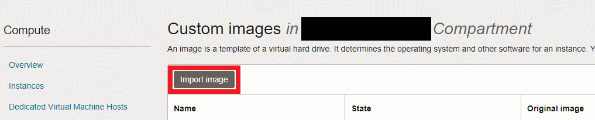

# oracle-zdm-install
**ZConverter Cloud DR enables you to minimize business data loss by configuring instantaneous recovery systems to the cloud in the event of a disaster or disaster. This article is a manual on how to make it easy for customers to install zdm through the web console.**

## Contents
> **[PREPARE](#prepare)**
> 
> **[ZDM IMAGE](#zdm-iamge)**
> 
> **[ZDM INSTALL](#zdm-install)**
---

## Prepare
1. Oracle cloud account that allows you to create an instance
2. [ZDM Image](#zdm-iamge) url you want to use

## ZDM Iamge

   - **The ZDM images currently supported are as follows.**
   - **Check [ZDM Install](#zdm-install) for instructions on how to use the address below.**

        <table>
        <tr>
            <th style="text-align:center">OS</th>
            <th style="text-align:center">Version</th>
            <th style="text-align:center">ZDMVersion</th>
            <th style="text-align:center">Image url</th>
        </tr>
        <tr>
            <td style="text-align:center">Ubuntu</td>
            <td style="text-align:center">20.04</td>
            <td style="text-align:center">latest</td>
            <td style="text-align:center" rowspan="2">
            <a href="https://objectstorage.ap-seoul-1.oraclecloud.com/p/ppovzltxdd7c00VBfLiDOppOmQzr5vAy7sIOF41_WPJFC6eQfUGAcd8quGx6PZfM/n/idffti7li8cs/b/_image/o/ZDM/ubuntu/20.04/zdm_latest">(ASHBURN REGION) ZDM IMAGE Ubuntu 20.04 Latest </a>
            <a href="https://objectstorage.us-ashburn-1.oraclecloud.com/p/fe4t-3LPvsmHCHwV1TMvQGkqELC_pmuTjVVcXuw-9ed4ZoqxMx1ADhqfDejXiEUN/n/idffti7li8cs/b/_image/o/ZDM/ubuntu/20.04/zdm_latest">(SEOUL REGION) ZDM IMAGE Ubuntu 20.04 Latest</a>
            </td>
        </tr>
        <tr></tr>
        <tr>
            <td style="text-align:center">Ubuntu</td>
            <td style="text-align:center">20.04</td>
            <td style="text-align:center">v0</td>
            <td style="text-align:center" rowspan="2">
            <a href="https://objectstorage.ap-seoul-1.oraclecloud.com/p/ppovzltxdd7c00VBfLiDOppOmQzr5vAy7sIOF41_WPJFC6eQfUGAcd8quGx6PZfM/n/idffti7li8cs/b/_image/o/ZDM/ubuntu/20.04/zdm_v0">(ASHBURN REGION) ZDM IMAGE Ubuntu 20.04 v0 </a>
            <a href="https://objectstorage.us-ashburn-1.oraclecloud.com/p/fe4t-3LPvsmHCHwV1TMvQGkqELC_pmuTjVVcXuw-9ed4ZoqxMx1ADhqfDejXiEUN/n/idffti7li8cs/b/_image/o/ZDM/ubuntu/20.04/zdm_v0">(SEOUL REGION) ZDM IMAGE Ubuntu 20.04 v0</a>
            </td>
        </tr>
        <tr></tr>
        </table>

## ZDM Install
   This step describes how to import and create an image with ZDM installed. I wrote this guide on the premise that you are logged in to Oracle Cloud by default.

1. **Click the Menu button at the top left - Compute - Custom Images**

     

2. **Click Import image**

    

3. **In the [ZDM Image](#zdm-iamge), select the ZDM version you want to install, then copy and paste the image url into the Object Storage URL. Specify type as OCI and click Import image**

    

4. **Click the Create instance button when the import is finished**

    

---
- **From number 5, I will explain except for the parts that are irrelevant to the user, such as names and compartments, when creating instances.**
---

5. **Shape must be VM.Standard.E4.Flex (cpu and memory can be changed)**

    

6. **For networks, you can select the network that you want to use.**
    - **If you have previously used ZDM and the VCN you used to use ZDM, you can use it without setting it up, but if you do not, you should follow the procedure below.**
    - Enter Network Security Groups on the VCN you want to use and click Create Network Security Group

        

    - The Destination Port Range should be changed after setting it up as shown in the picture below.
    - There are multiple ports that need to be added, so clicking Another Rule will create multiple Rule blocks.
    - The ports you need to add are [80, 111, 139, 443, 445, 2049, 53306]. Enter this value one by one in the Destination Port Range
    - If you need to connect to vm, you can configure 22 ports separately.

        

7. **Register user ssh key and click Create**
    

8. **Verify ZDM operation after accessing with authorized ip**

    
    